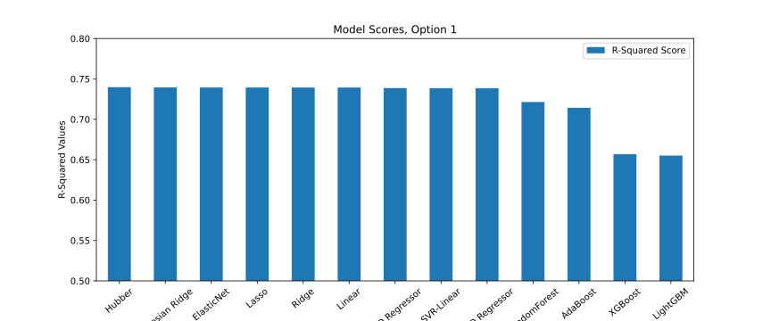
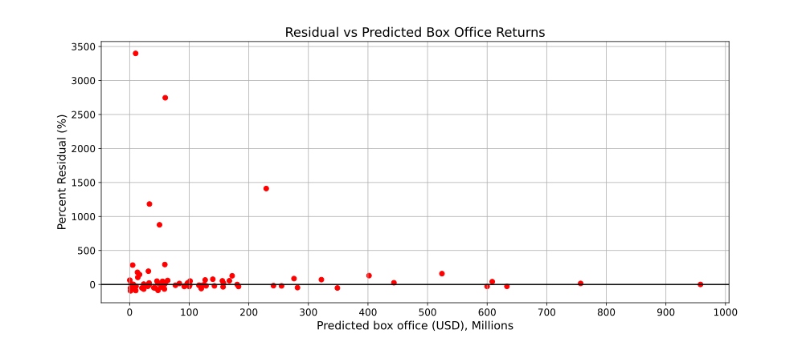

# Movie Franchise/Sequel Predictor

**Date: October 28th, 2020**

Added modeling notebook

`05_Box_Office_Movie_Franchise_Predictor_Modeling.ipynb`

The image below shows the R2-scores for several regressors to predict the box office returns of a movie sequel

and the another Figure showing the percent residual as a function of predicted returns

**Date: October 26th, 2020**

Comments:

1. Renamed all notebook files

2. Performed some Exploratory Data Analysis (EDA) on movie data. Notebook name is 

`04_Box_Office_Movie_Franchise_Predictor_EDA.ipynb`

**Date: October 22nd, 2020**

Made significant progress. Namely:

1. Wrangled, sourced, cross-referenced missing data. There are still some missing portions but the important ones such as budgets have are fixed.

2. Split data files into 'original' and 'sequel'

File name of jupyer notebook is 

`Box_Office_Movie_Franchise_Predictor_Cleaning.ipynb`

**Date: July 9th, 2020**

Fixed a bug in the jupyter notebook `3.5.2_IMDB_webscrapper_sequels_franchise_part_02.ipynb`. It was copying the same urls for all.

**Date: June 24th, 2020**

I will update the README as changes are made to this repository. The purpose of this submission is to provide three possible data sources for Springboard's Capstone projects. **Please look at the date stamp above to make sure it is the latest**. 

1. **Dataset 1:** Being somewhat of movie fanatic myself both foreign and domestic, I have always wondered how does a movie studio budget a movie especially a sequel or franchise of movies. Movies have existed for more than a century, but it is only within the last 50 years that relevant data have been collected. In order to budget, one must at least predict what the movie would make. A great example is Star Wars: A New Hope. No one knew beforehand it was going to be a success and when it did, only then 'The Empire Strikes Back' was alotted a larger budget to produce. However, if a movie studio deems that a sequel is not likely make a profit, then it will have to think twice on how to improve the sequel or not go ahead at all.
    
    So for this project I would like to predict with reasonable accuracy the box office returns of a movie sequel. This repository contains notebooks that webscrape data from the IMDB movie database. The data contained in the `data/` sub-directory contains a list of csv files that are relevant. The most important file that has been wrangled, cleaned and curated is 
    
    `movies_with_sequels_imdb_details_modified_restoring_urls_complete.csv`
    
    
   The above file contains movie titles, urls, release dates, box office numbers, etc for movies in a sequel, franchise or 'universe'. Further cleaning is still required.
   
    
2. **Dataset 2: (Not included)** This will be on Computer Vision and potentially some Natural Language Processing (NLP). I have downloaded the MS-COCO dataset. MS-COCO stands for Microsoft Common Objects in Context. It contains a variety of photograph images which are already captioned and can be used for automatic photo captioning and image segmenatation. The total number of images is over 100,000. If one goes to the website  

<<<<<<< HEAD
   `https://cocodataset.org/#download` 
  
	I chose the 2017 Train/Val/Test dataset. Again, the dataset is not included in this repository as it is large.
=======
	`https://cocodataset.org/#download` 
  
  	I chose the 2017 Train/Val/Test dataset. Again, the dataset is not included in this repository as it is large.
>>>>>>> 8db05037a202e0f06b780fca819589d5159abb74
  
3. **Dataset 3: (Not included)** This is a Natural Language Processing (NLP) project. I listen to the Joe Rogan Experience podcast quite often and have been fascinated with the type of guests and topics that Joe Rogan brings on his show. What I would like to achieve is to generate via Deep Learning and NLP, a fictitious Joe Rogan podcast based on the transcripts of all his guests since the range of topics is so diversed. I have found a website that has transcribed all of his podcasts since the beginning and I would like to use it as input data. I will need to webscrape it which I have not done yet. There is an API to download it but is available to paid subscribers. As to how much this costs is unknown as I have to email them and find out. Nonetheless, this is a work in progress. The website is 

	`www.podgist.com`

   

